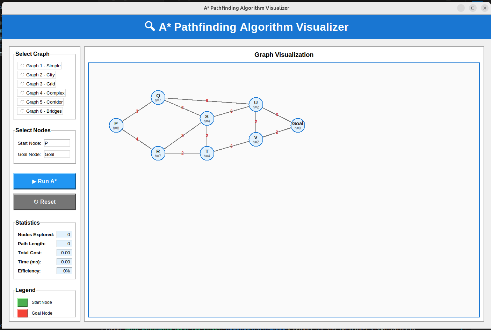
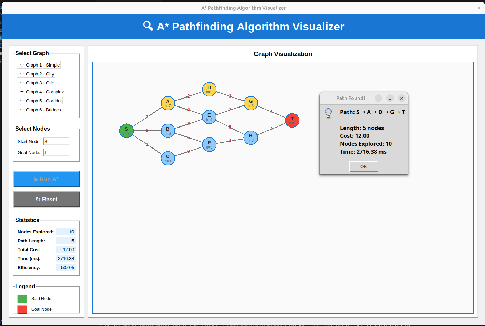

# 🔍 A* Pathfinding Algorithm Visualizer

An interactive desktop application that visualizes the A* pathfinding algorithm in real-time. Built with Python and Tkinter, this project demonstrates how A* efficiently finds the shortest path in weighted graphs using heuristics.

[](https://www.python.org/downloads/)
[](LICENSE)
[](https://github.com/Maloy-Baroi/A_star_pathfinder/stargazers)

## 📸 Screenshots

### Main Interface


### Path Finding in Action


## ✨ Features

- **🎨 Interactive Visualization**: Watch the A* algorithm explore nodes in real-time
- **📊 Multiple Sample Graphs**: Pre-loaded graphs including Romania map, city networks, and maze structures
- **📈 Real-time Statistics**: Track nodes explored, path length, cost, and execution time
- **🎯 Custom Start/Goal Selection**: Choose any nodes as start and goal points
- **⚡ Animation Speed Control**: Adjust visualization speed with a slider (0.01s - 1s per step)
- **🔄 Reset & Replay**: Easy reset functionality to try different paths
- **📐 Visual Legend**: Clear color coding for different node states
- **💯 Efficiency Metrics**: Calculate and display path efficiency

## 🎯 Algorithm Features

- **Optimal Pathfinding**: Guarantees shortest path when heuristic is admissible
- **Heuristic-based Search**: Uses estimated cost to goal for efficient exploration
- **Priority Queue**: Implements efficient node exploration using heap
- **Comprehensive Statistics**: Detailed performance metrics

## 🚀 Getting Started

### Prerequisites

- Python 3.7 or higher
- pip (Python package installer)

### Installation

1. **Clone the repository**
   ```bash
   git clone https://github.com/Maloy-Baroi/A_star_pathfinder.git
   cd A_star_pathfinder
   ```

2. **Create a virtual environment (recommended)**
   ```bash
   python3 -m venv venv
   source venv/bin/activate  # On Windows: venv\Scripts\activate
   ```

3. **Install dependencies**
   ```bash
   pip install -r requirements.txt
   ```

### Running the Application

**GUI Visualizer (Recommended)**
```bash
python3 A_star_pathfinder_visualization.py
```

**Command-line Version**
```bash
python3 A_start_pathfinder.py
```

## 📖 How to Use

1. **Launch the application** using the command above
2. **Select a sample graph** from the dropdown menu:
   - Romania Map
   - Simple Network
   - City Network
   - Complex Network
   - Grid Maze
3. **Choose start and goal nodes** from the respective dropdowns
4. **Adjust animation speed** using the slider (optional)
5. **Click "Run A* Algorithm"** to visualize the pathfinding process
6. **Watch the visualization**:
   - 🟦 Blue nodes: Unexplored
   - 🟩 Green node: Start point
   - 🟥 Red node: Goal point
   - 🟦 Light blue: Explored/visited nodes
   - 🟨 Yellow: Final shortest path
7. **View statistics** in the left panel
8. **Click "Reset"** to try different configurations

## 🎨 Color Legend

| Color | Meaning |
|-------|---------|
| 🟦 Blue | Unvisited node |
| 🟩 Green | Start node |
| 🟥 Red | Goal node |
| 🟦 Light Blue | Visited/explored node |
| 🟨 Yellow | Shortest path found |
| ⬛ Gray | Graph edges |

## 📊 Sample Graphs

The application includes several pre-configured graphs:

1. **Romania Map**: Classic AI problem - finding paths between Romanian cities
2. **Simple Network**: Basic graph for learning A* fundamentals
3. **City Network**: Medium complexity urban network
4. **Complex Network**: Advanced graph with multiple paths
5. **Grid Maze**: Grid-based pathfinding scenario

## 🧮 Algorithm Complexity

- **Time Complexity**: O(E log V) where E is edges and V is vertices
- **Space Complexity**: O(V) for storing nodes and paths

## 📁 Project Structure

```
A_star_pathfinder/
│
├── A_star_pathfinder_visualization.py  # Main GUI application
├── A_start_pathfinder.py              # Core algorithm implementation
├── requirements.txt                    # Python dependencies
├── README.md                          # This file
├── image1.png                         # Screenshot 1
├── image2.png                         # Screenshot 2
└── .gitignore                         # Git ignore file
```

## 🔧 Technical Details

### Core Algorithm Components

1. **Priority Queue**: Uses Python's `heapq` for efficient min-heap operations
2. **f(n) = g(n) + h(n)**:
   - `g(n)`: Actual cost from start to node n
   - `h(n)`: Heuristic estimated cost from n to goal
   - `f(n)`: Total estimated cost
3. **Admissible Heuristic**: Ensures optimal path finding

### Key Files

- **`A_star_pathfinder_visualization.py`**: Complete GUI implementation with Tkinter
- **`A_start_pathfinder.py`**: Core A* algorithm with detailed implementation

## 🎓 Educational Use

This project is ideal for:
- Computer Science students learning graph algorithms
- Understanding heuristic search algorithms
- Visualizing algorithm behavior
- Algorithm analysis and comparison
- Academic presentations and demonstrations

## 🤝 Contributing

Contributions are welcome! Here's how you can help:

1. Fork the repository
2. Create a feature branch (`git checkout -b feature/AmazingFeature`)
3. Commit your changes (`git commit -m 'Add some AmazingFeature'`)
4. Push to the branch (`git push origin feature/AmazingFeature`)
5. Open a Pull Request

## 📝 Future Enhancements

- [ ] Add more graph types (weighted grids, real-world maps)
- [ ] Compare A* with Dijkstra and other algorithms
- [ ] Save/load custom graphs
- [ ] Export visualization as GIF/video
- [ ] Add diagonal movement in grid mazes
- [ ] 3D graph visualization

## 🐛 Known Issues

- None currently reported

## 📄 License

This project is licensed under the MIT License - see the [LICENSE](LICENSE) file for details.

## 👤 Author

**Maloy Baroi**
- GitHub: [@Maloy-Baroi](https://github.com/Maloy-Baroi)
- Course: CSE 511 Advanced Algorithms
- Date: December 11, 2025

## 🙏 Acknowledgments

- Inspired by classic AI pathfinding problems
- Built for educational purposes
- Thanks to the Python and Tkinter communities

## 📚 References

- [A* Search Algorithm - Wikipedia](https://en.wikipedia.org/wiki/A*_search_algorithm)
- [Pathfinding Algorithms](https://www.redblobgames.com/pathfinding/a-star/introduction.html)
- Russell, S., & Norvig, P. (2020). *Artificial Intelligence: A Modern Approach*

---

⭐ If you found this project helpful, please consider giving it a star!

**Made with ❤️ for Algorithm Enthusiasts**
